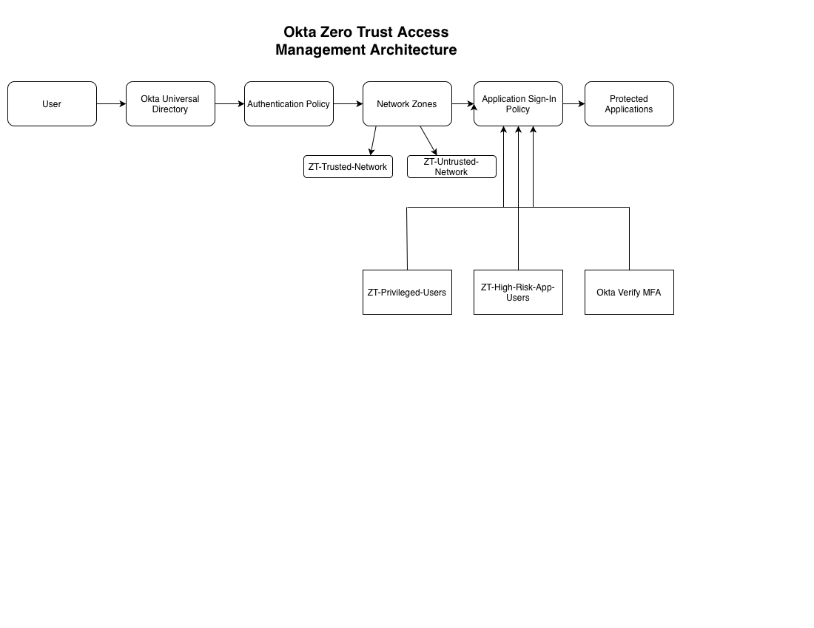

# Okta Zero Trust Access Management

## Executive Summary

This project demonstrates a Zero Trust access management implementation using Okta. The lab simulates how an enterprise can require stronger authentication for sensitive applications based on user group, application risk, and access context.

## Business Problem

Northwind Manufacturing wants to reduce identity-based risk by enforcing stronger authentication for sensitive applications. Standard username and password access is no longer sufficient for applications containing business-critical or administrative data.

## Project Goal

Build an Okta Zero Trust access model using groups, applications, authenticators, network context, and authentication policies.

## Technologies Used

- Okta Developer Tenant
- Okta Groups
- Okta Applications
- Okta Authenticators
- Okta Authentication Policies
- Okta App Sign-In Policies
- Okta System Log
- GitHub
- VS Code

## IAM Concepts Demonstrated

- Zero Trust access
- MFA enforcement
- Context-aware authentication
- Group-based access control
- App-level authentication policy
- Network-aware access decisions
- Least privilege
- Audit validation

## Project Status

## Architecture

The following diagram illustrates the Zero Trust access flow implemented in this project.



## Authentication Flow

```text
User
   │
   ▼
Okta Universal Directory
   │
   ▼
Authentication Policy
   │
   ▼
Network Zones
   │
   ▼
Application Sign-In Policy
   │
   ▼
Protected Applications
```

## Design Decisions

- Group-based access control
- Password + Okta Verify MFA
- Trusted vs Untrusted Network Zones
- Separate authentication policies for privileged and high-risk users
- Least privilege and Zero Trust principles

## Production Considerations

In production, these policies would integrate with Microsoft Entra ID, HR systems, SIEM platforms, and device trust signals to provide adaptive authentication and continuous access evaluation.

## Lessons Learned

- Authentication Policies and App Sign-In Policies serve different purposes.
- Network Zones provide contextual access decisions.
- Group-based policy assignment scales better than assigning users individually.
- Zero Trust is achieved through identity, context, and continuous verification.

## Resume Bullet

Designed and implemented an Okta Zero Trust access management solution using Authentication Policies, Application Sign-In Policies, MFA enforcement, Network Zones, RBAC, ABAC, and context-aware authentication to secure privileged and high-risk enterprise applications.